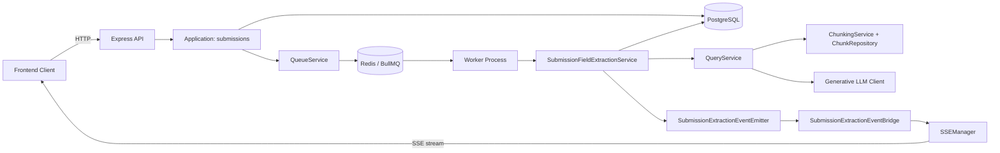
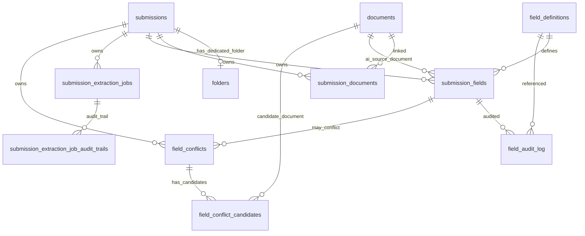
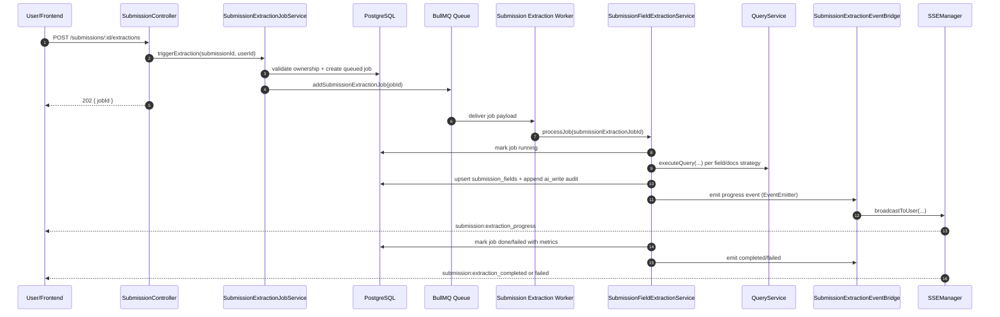
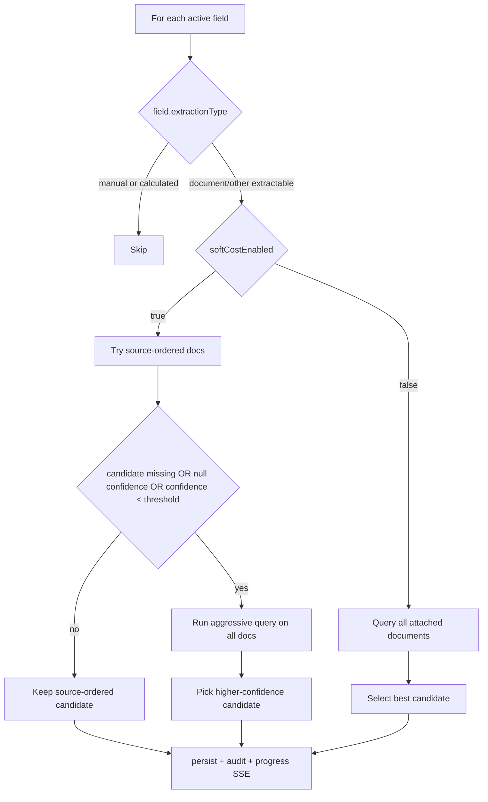

# Submission Feature Technical Guide (Current State)

Last updated: 2026-04-06  
Source of truth: `tabular-review-backend` current implementation

## 1. Purpose of this document

This guide explains the Submission feature end-to-end for someone who has never seen the codebase.

After reading this file, you should understand:

- what business problem "Submissions" solves
- which APIs exist and what they do
- how data is modeled and persisted
- how AI extraction is triggered and executed
- how realtime progress is pushed to clients
- what is implemented today vs what is still planned

## 2. What the Submission feature is

A Submission is an underwriting intake container:

- it has business metadata (`name`, `lineOfBusiness`, `brokerName`, etc)
- it owns a dedicated folder
- it links uploaded documents to the submission context
- it exposes field values (manual + AI)
- it can run an async extraction job that fills fields from attached docs

## 3. Current scope (implemented so far)

Implemented in backend:

- Submission CRUD-ish API (create, list, get, patch)
- attach/list/update submission documents
- read submission fields by block
- manual field edits with audit log
- trigger extraction job endpoint (`POST /submissions/:id/extractions`)
- BullMQ queue + worker for stage 1 extraction loop
- SSE events for extraction progress/completion/failure
- aggressive-by-default extraction with optional soft-cost fallback

Planned but not implemented:

- stage 2 conflict detection runtime behavior
- stage 3 adjudication runtime behavior
- stage 4 calculated/manual stubs runtime behavior
- conflict resolution API endpoints

## 4. High-level architecture

## 5. Layered design in this feature

The structure follows a clean-architecture style:

- `domain/submissions`: entities, value objects, domain errors
- `application/submissions`: use cases + ports/interfaces + orchestration
- `infrastructure/submissions`: Knex repositories and persistence mapping
- `api/controllers/submissions`: HTTP + schema validation + DTO mapping
- `workers/processors/submission-extraction.processor.ts`: async job consumer

Important implementation note:

- the extraction event bridge currently imports infrastructure types (`SSEManager`, `SSEEventFactory`) directly in the application layer. This is tracked as known tech debt in `tab-dev-docs/tech-debt.md`.

## 6. Core domain model

### 6.1 Submission aggregate

Main file: `src/domain/submissions/submission.ts`

- statuses: `draft | in_review | quoted | declined | bound`
- supports `update(...)`, `rename(...)`, `updateStatus(...)`
- owns key metadata and timestamps

### 6.2 Field definitions (registry)

Main file: `src/domain/submissions/field-definitions/field-definition.ts`

- metadata-driven schema for all expected submission fields
- includes extraction hints:
  - `primarySource`
  - `fallbackSecondarySource`
  - `extractionPrompt`
  - `fieldType`, `options`, etc

### 6.3 Submission fields

Main file: `src/domain/submissions/submission-fields/submission-field.ts`

- stores:
  - `aiValue`, `aiConfidence`, source doc/page/chunks
  - `currentValue` (the effective value shown to users)
  - manual-edit flags and editor notes
  - validation status (`ok`, `missing`, `conflict`, `low_confidence`)

### 6.4 Submission extraction jobs

Main file: `src/domain/submissions/submission-extraction-jobs/submission-extraction-job.ts`

- job lifecycle:
  - `queued -> running -> done|failed`
- tracks metrics (`fieldsExtracted`, `avgConfidence`, etc)
- accumulates domain audit entries (`_uncommittedAuditLogs`)

## 7. Persistence model (database)

Key constraints that matter operationally:

- `submissions.submission_ref` unique
- `submissions.folder_id` unique (one folder per submission)
- `submission_documents(submission_id, document_id)` unique (idempotent attach)
- `submission_fields(submission_id, field_key)` unique (idempotent upsert)
- partial unique index on `submission_extraction_jobs(submission_id) where status='running'`
- partial unique index on `field_definitions(field_key) where is_current=true`

Relevant migrations:

- `20260211183000_create_submissions_and_submission_documents.ts`
- `20260211190000_create_submission_fields_table.ts`
- `20260211193000_create_submission_extraction_jobs_table.ts`
- `20260211200000_create_field_conflicts_tables.ts`
- `20260211203000_create_field_audit_log_table.ts`
- `20260402100000_add_name_to_submissions.ts`
- `20260403143000_create_submission_extraction_job_audit_trails_table.ts`

## 8. API surface (submission endpoints)

Routes file: `src/api/controllers/submissions/submission.routes.ts`

| Method | Path | Purpose |
|---|---|---|
| `GET` | `/api/submissions` | List user submissions (paginated) |
| `POST` | `/api/submissions` | Create submission |
| `GET` | `/api/submissions/:id` | Get one submission |
| `PATCH` | `/api/submissions/:id` | Update submission metadata/status |
| `POST` | `/api/submissions/:id/documents` | Attach document |
| `GET` | `/api/submissions/:id/documents` | List attached docs (paginated, includes doc summary) |
| `PATCH` | `/api/submissions/:id/documents/:documentId` | Update `docType` |
| `GET` | `/api/submissions/:id/fields` | Get fields grouped by block |
| `PATCH` | `/api/submissions/:id/fields/:fieldId` | Manual field edit |
| `POST` | `/api/submissions/:id/extractions` | Trigger async extraction job |

Validation:

- Zod schemas in `submission.schemas.ts`
- all submission IDs validated as UUID
- strict body schemas

Ownership/security:

- `assertSubmissionOwnership(...)` ensures only submission owner can read/write
- document attach also checks document ownership

Error mapping:

- `SubmissionExtractionJobConflictError` maps to HTTP 409
- `*NotFoundError` maps to HTTP 404
- `ForbiddenError` maps to HTTP 403

## 9. Service responsibilities (application layer)

### 9.1 `SubmissionService`

File: `src/application/submissions/submission.service.ts`

Responsibilities:

- create submission in one transaction:
  1. generate `submission_ref`
  2. create `submissions` row
  3. create dedicated folder with `folder_type='submission'`
  4. patch submission with `folder_id`
- list/get/update submission
- attach document (idempotent via repository)
- list/update submission documents

### 9.2 `SubmissionFieldService`

File: `src/application/submissions/submission-fields/submission-field.service.ts`

Responsibilities:

- read fields by block:
  - combine active definitions with existing submission field rows
  - return complete registry shape even when values are missing
- upsert manual edits:
  - validate field definition exists
  - upsert manual value
  - append `user_edit` audit log

### 9.3 `SubmissionExtractionJobService`

File: `src/application/submissions/submission-extraction-jobs/submission-extraction-job.service.ts`

Responsibilities:

- transactional trigger path:
  1. validate submission + ownership
  2. enforce no active job already running/queued
  3. create job row as `queued`
- enqueue BullMQ job after DB commit

## 10. Stage 1 extraction worker (deep dive)

### 10.1 Runtime flow

### 10.2 Field extraction strategy

Core file: `src/application/submissions/submission-extraction-worker/submission-field-extraction.service.ts`

Behavior details:

- default mode (`softCostEnabled=false`): aggressive search on all submission docs
- soft-cost mode:
  - try source-ordered docs first (`primarySource` then `fallbackSecondarySource`)
  - fallback to aggressive when:
    - no value
    - `confidence` is `null`
    - `confidence < lowConfidenceThreshold`
- winner rule:
  - higher confidence wins
  - `null` confidence is lowest
  - tie keeps source-ordered candidate

Quality and performance details:

- fields processed with configurable concurrency (`fieldProcessingConcurrency`)
- source page lookup is done only for winner candidate (avoids N+1 lookups)
- prompt appends deterministic token contract:
  - not found token: `__SUBMISSION_FIELD_NOT_FOUND__`
- manual edits are preserved in DB on AI upsert:
  - if `is_manually_edited=true`, keep existing `current_value`

## 11. Reusing QueryService for submissions

The extraction worker reuses existing `QueryService` with an adapter:

- `QueryService` depends on `IReviewDocumentMembershipRepository`
- `SubmissionReviewDocumentRepositoryAdapter` maps:
  - `reviewId` -> `submissionId`
  - validates requested docs against `submission_documents`

Why this matters:

- no duplicate query orchestration logic
- type-safe wiring (no unsafe cast required)
- submission extraction gets chunk retrieval + response processing consistency

## 12. Queue and worker behavior

Queue producer:

- `QueueService.addSubmissionExtractionJob(...)`
- queue name: `${env}-submission-extraction-queue`
- job options:
  - attempts: `3`
  - backoff: exponential, base delay `10000ms`
  - dedupe by `jobId = submissionExtractionJobId`

Worker consumer:

- file: `src/workers/processors/submission-extraction.processor.ts`
- invokes `submissionFieldExtractionService.processJob(...)`
- logs completion/failure with attempt metadata

Operational note:

- worker process concurrency for extraction queue is controlled by `appConfig.workers.extractionConcurrency`
- field-level concurrency inside a single submission job is separately controlled by `submissionExtraction.fieldProcessingConcurrency`

## 13. Realtime events (SSE)

Event types emitted for submission extraction:

- `submission:extraction_progress`
- `submission:extraction_completed`
- `submission:extraction_failed`

Flow:

1. extraction service emits domain-style event via `EventEmitter`
2. `SubmissionExtractionEventBridge` converts to SSE event payload
3. `SSEManager.broadcastToUser(userId, event)` sends to connected user streams

Client subscription endpoint:

- `GET /api/sse/connect` (auth required)
- optional `workspaceId` query param

## 14. Configuration knobs for submissions extraction

From `config/default.json` + schema:

| Key | Default | Meaning |
|---|---|---|
| `submissionExtraction.softCostEnabled` | `false` | Enable source-ordered-first strategy before aggressive fallback |
| `submissionExtraction.lowConfidenceThreshold` | `0.7` | Fallback trigger threshold and low-confidence validation threshold |
| `submissionExtraction.fieldProcessingConcurrency` | `3` | Number of fields processed in parallel within one job |

Env vars:

- `SUBMISSION_EXTRACTION_SOFT_COST_ENABLED`
- `SUBMISSION_EXTRACTION_LOW_CONFIDENCE_THRESHOLD`
- `SUBMISSION_EXTRACTION_FIELD_PROCESSING_CONCURRENCY`

## 15. Reliability and data integrity guarantees

Built-in protections:

- idempotent document attach (`submission_id + document_id` unique)
- idempotent field writes (`submission_id + field_key` unique + upsert)
- one active running job per submission (partial unique index)
- manual edits protected from AI overwrite at repository merge SQL level
- ownership checks in all mutation/read service paths
- extraction job state transitions persisted with metrics

## 16. Testing coverage (where confidence comes from)

Key test areas:

- API e2e for all submission routes in `src/api/controllers/submissions/*.e2e.test.ts`
- service unit tests:
  - `submission.service.test.ts`
  - `submission-field.service.test.ts`
  - `submission-extraction-job.service.test.ts`
  - `submission-field-extraction.service.test.ts`
- infra integration tests:
  - submission repo
  - submission document repo
  - submission field repo
  - field audit log repo

## 17. What is still missing

The schema for later phases exists (`field_conflicts`, `field_conflict_candidates`), but runtime behavior is still incomplete:

- no conflict generation writes in worker stage 2
- no adjudication orchestration in worker stage 3
- no API for conflict list/resolve
- no stage 4 calculation/manual-stub completion behavior

## 18. New engineer quick start

Recommended learning order:

1. API contract:
   - `src/api/controllers/submissions/submission.routes.ts`
   - `src/api/controllers/submissions/submission.controller.ts`
2. service orchestration:
   - `src/application/submissions/submission.service.ts`
   - `src/application/submissions/submission-fields/submission-field.service.ts`
3. async extraction trigger:
   - `src/application/submissions/submission-extraction-jobs/submission-extraction-job.service.ts`
   - `src/infrastructure/queue/queue.service.ts`
4. extraction engine:
   - `src/application/submissions/submission-extraction-worker/submission-field-extraction.service.ts`
   - `src/workers/processors/submission-extraction.processor.ts`
5. realtime:
   - `src/application/sse/submission-extraction-event-bridge.ts`
   - `src/infrastructure/sse/sse-event-factory.ts`
6. persistence:
   - `migrations/20260211183000_create_submissions_and_submission_documents.ts`
   - `migrations/20260211190000_create_submission_fields_table.ts`
   - `migrations/20260211193000_create_submission_extraction_jobs_table.ts`

## 19. Key file map

| Area | File |
|---|---|
| API routes | `src/api/controllers/submissions/submission.routes.ts` |
| API controller | `src/api/controllers/submissions/submission.controller.ts` |
| API schemas/DTOs | `src/api/controllers/submissions/submission.schemas.ts` |
| Submission service | `src/application/submissions/submission.service.ts` |
| Manual fields service | `src/application/submissions/submission-fields/submission-field.service.ts` |
| Trigger extraction service | `src/application/submissions/submission-extraction-jobs/submission-extraction-job.service.ts` |
| Extraction stage 1 engine | `src/application/submissions/submission-extraction-worker/submission-field-extraction.service.ts` |
| Submission app wiring | `src/application/submissions/index.ts` |
| Queue service | `src/infrastructure/queue/queue.service.ts` |
| Worker processor | `src/workers/processors/submission-extraction.processor.ts` |
| SSE bridge | `src/application/sse/submission-extraction-event-bridge.ts` |
| Submission repository | `src/infrastructure/submissions/submission.repository.ts` |
| Submission document repository | `src/infrastructure/submissions/submission-documents/submission-document.repository.ts` |
| Submission field repository | `src/infrastructure/submissions/submission-fields/submission-field.repository.ts` |
| Extraction job repository | `src/infrastructure/submissions/submission-extraction-jobs/submission-extraction-job.repository.ts` |

